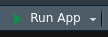
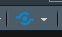

```{r, include = FALSE}
knitr::opts_chunk$set(
  collapse = TRUE,
  comment = "#>"
)
```

# Introduction

The goal of this document is to make you familiar with the workflow related to Policy Simulator app.

The document consists of the following sections:

- [Running the application locally](#running-the-application-locally)
- [Deployment](#deployment)

# Running the application locally

When the application was successfully generated, open `app.R` file in its directory and click `Run App` button:



The Application should be automatically open in your default browser.

# Deployment

Currently, the application can be deployed to shinyapps.io service.

In order to deploy the application:

1. Register your shinyapps.io account as described [here](https://shiny.rstudio.com/articles/shinyapps.html#create-a-shinyappsio-account).
2. Open `app.R` file in RStudio.
3. Click Publish button and follow [the instructions](https://shiny.rstudio.com/articles/shinyapps.html#deploying-apps).

()
