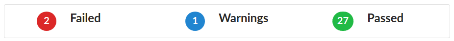
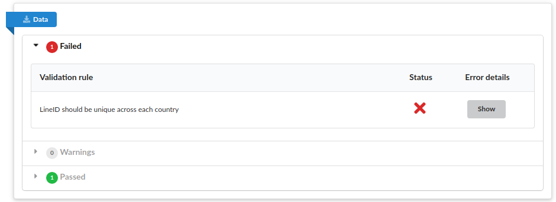
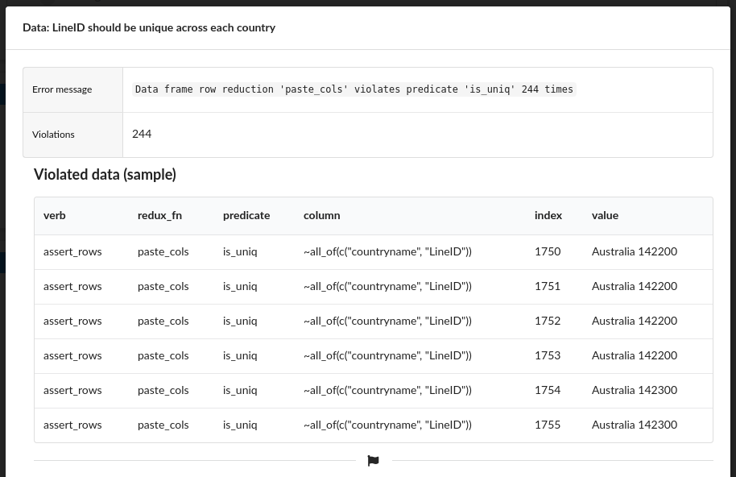
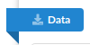

```{r, include = FALSE}
knitr::opts_chunk$set(
  collapse = TRUE,
  comment = "#>"
)
```

# Introduction

The goal of this document is to make you familiar with the steps that should be taken to generate Policy Simulator based on already prepared template.

The document consists of the following sections:

- [System requirements](#system-requirements)
- [Generating Policy Simulator](#generating-policy-simulator)
- [Template Validation](#template-validation)
- [Next step - Policy Simulator app](application.html)

# System requirements

Operating system: no specific operating system restrictions.

`R` version: `3.0.2 and higher`.

`R` dependencies:

- `shiny (>= 1.5.0)`
- `dplyr (>= 1.0.2)`
- `assertr (== 2.6.9000)`. Install with `remotes::install_github("ropensci/assertr@master")`.
- `data.validator (>= 0.1.3)`. Install with `remotes::install_github("Appsilon/data.validator@master")`.
- `dqshiny (>= 0.0.5)`. Install with `remotes::install_github("daqana/dqshiny@master")`.
- `PolicySimulator (>= 0.1.4)`.

# Generating Policy Simulator

When all the system requirements are met, and Policy Simulator template is ready simply run:

```
PolicySimulator::generate_simulator(<path-to-excel-template>, <target-application-path>)
```

where:

- `<path-to-excel-template>` is a path to the Policy Simulator template (absolute or relative to current working directory),
- `<path-to-excel-template>` is a path where target application should be generated (absolute or relative to current working directory)

The application generation is divided into the below steps:

1. template validation process - verification of raw template data (see more in [data validation]() section),
2. computing default scores - based in the information provided within a template,
3. preprocessing template data - attaching UI Elements definition to the target application data, extracting template metadata etc.
4. second stage of data validation - simple comparison of template scores with the one computed by the package,
5. generating application code - saving created data and application code to the target directory.

When the process finishes successfully (and was run from within RStudio console), the application file should be automatically opened in RStudio tab, that allow to run the application.

# Template validation

In the [Policy Simulator Template](template.html) vignette, there were described multiple template data assumptions.
The assumption marked with `(v)`, are automatically checked during template validation step.

Violation of any of the rules (marked as required) during first stage of validation, results with stopping Policy Generation process.
All the violations are included in `validation_report.html` file included in target application path (second parameter of `PolicySimulator::generate_simulator`).

Violation of any of the rules during second stage of validation, does not result with stopping Policy Generation process.
All the violations are just informative and included in `post_processing_report.html` file included in target application path (second parameter of `PolicySimulator::generate_simulator`).

## How to read validation report?

**Header**

Report header displays summary of the validation.
You may find here how many assertions were checked and especially how many of them violated in the template.



**Per data section**

Each sourced or preprocessed dataset is separately validated with own set of rules.
Such dataset is described in the report in a separate section:



The segment title aims to shortly describe what kind of data is covered in the section.

Each rule is described in a separate accordion field.
For the data that didn't pass the validation, such field stores more detailed information about violation:

- clicking `show` button results with showing more technical violation details along with the sample of violated data rows



- violated part of the data is automatically saved in the target application directory, or may be directly downloaded from within a template



Downloaded dataset is extended with additional columns that describes technical details of violation. Such columns are:

- `table_name` - name of the table (visible in the data sector title),
- `assertion.id` - unique identifier of assertion,
- `description` - description of the violated rule,
- `num.violations` - total number of rows that violated the rule,
- `index` - violated row number,
- `value` - value that violated the rule,
- `column` - name of the column in which violation occurred,
- `call`, `message`, `type`, `verb`, `redux_fn`, `predicate` - other technical columns valuable from development perspective.

When the violated rule was fixed, save the template run Policy Simulator generation again.

# [Next step - Policy Simulator app](application.html)

