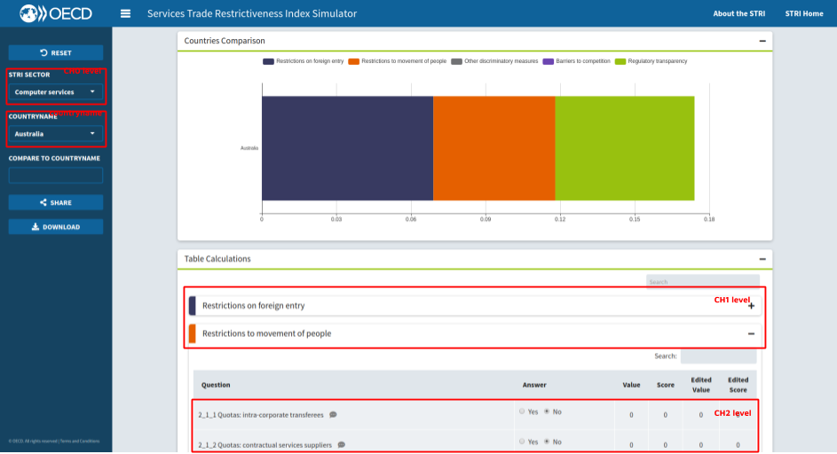
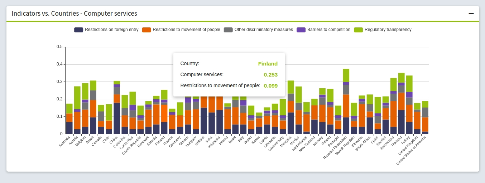
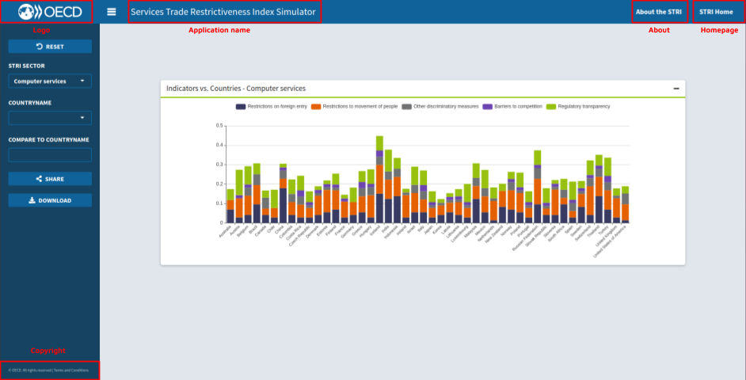
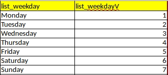
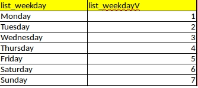
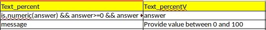

```{r, include = FALSE}
knitr::opts_chunk$set(
  collapse = TRUE,
  comment = "#>"
)
```

# Introduction

The goal of this document is to make you familiar with the concept of Policy Simulator template.

The document consists of the following sections:

- [General information](#general-information)
    - [What is the template?](#what-is-the-template)
- [Template structure](#template-structure)
    - [Hierarchy Sheet](#hierarchy-sheet)
    - [Data Sheet](#data-sheet)
    - [Indicator Sheet](#indicator-sheet)
    - [List Sheet](#list-sheet)
    - [Apps Sheet](#apps-sheet)
- [Next step - Policy Simulator generation](generation.html)

# General information

## What is the template?

The template is an Excel Spreadsheet that stores information and instructions how the target Policy Simulator app should behave.

The template stores such information as:

- hierarchy levels and its meta information that tells the application how to structure its logic
- information about countries to which policy rules should be applied
- information about the sectors in which do we want to define policies along with the scoring rules applied in each sector
- general information about the application (titles, header, about etc.)
- list of possible controls used in the application

The template is the single point of information that allows to generate the target Policy Simulator Shiny app.

## How the get the example skeleton?

Simply run:

```
PolicySimulator::get_template(<path>)
```

where `<path>` is a directory where the template should be saved.

# Template structure

The template should consist of the following sheets:

- [Hierarchy Sheet](#hierarchy-sheet)
- [Data Sheet](#data-sheet)
- [Indicator Sheet](#indicator-sheet)
- [List Sheet](#list-sheet)
- [Apps Sheet](#apps-sheet)

The below subsections describe the format, content and how each sheet affects the target Policy Simulator app.

## Hierarchy Sheet

The hierarchy sheet stores information about possible levels that should be used in the application logic.
Such levels define for example:
- How the data should be divided in the application (which level the end-user should be able to choose in each the application dropdowns).
- What information should be used and displayed in the application tables.

Typical information stored in levels are:

- countries
- sectors
- subsectors
- measures

An example impact of levels in the application is shown in the below graphic:


Below you may find detailed information about the sheet columns.
Each column is divided into the following sections:

- description - informative column description
- impact - what is the role of the column in Policy Simulator logic
- validity - what are the assumptions about the column format and content. Each assumption is followed by `(v)` which means, the assumption is automatically checked during the [data validation](generation.html#data_valdiation) process. `(uv)` means the rule is not implemented yet.

#### Code 

**Description**

Unique identifier of the hierarchy level.
There are at least 4 levels required:

- `countryname`
- `CH0`, `CH1`, `CH2`

The hierarchy of levels is read from the top to the bottom (excluding `countryname`).
That means if the level CH1 is placed below CH0 in the hierarchy sheet, CH1 is the subset of CH0 (provides a more detailed division of CH0).
The latest defined level, i.e. CH2 is usually treated as the most granular level (named `evaluate`) that is converted to a single table row allowing the user to provide detailed information to Policy Simulator (like answering the questions).

**Impact**

Definition of levels hierarchy.
Defines what columns should be taken into account from Data and Indicator sheets.

**Validity**

- Required column (v).
- Column format: `character` (uv).
- Either `countryname`, or ID of the form `CH<number>` (v).
- Requires corresponding columns in Data (`countryname`) and Indicator (`CH<number>`) named exactly like the level value (v).
- Minimal number of levels (excluding countryname): 3 (v).
- Maximum number of levels (excluding countryname): 8 (v).

#### Name

**Description**

Descriptive name of the level.

**Impact**

Only country level, and CH0 levels names are used.
The ones are displayed in the dropdown labels.

**Validity**

- Required column (v).
- format: character (uv)

#### Aggregation method

**Description**

Defines whether the level should be considered in weighted aggregation logic.
The aggregated values for each level are visible in the application charts tooltip.

**Impact**

Possible values and its impact:

- none - no aggregation done for the level.
- WeightedAverage - aggregation is performed.
- evaluate - no aggregation done, but the level is treated as a more detailed placed in application table rows. Usually treated as questions.



**Validity**

- Required column (v).
- format: character (uv)
- Possible values set: `none`, `WeightedAverage`, `evaluate` (uv).
- Only one `evaluate` allowed (v).

#### Aggregation of missing data

*Currently unused*

#### Selector1

**Description**

Defines which levels the user will be available to select from in the top application dropdown.
`YES` value means, the level should be applied.
The level also affects policy generation logic.

**Impact**

Allows choosing which level data should be currently displayed in the application.

The "selector1" level defines as well how the data should be grouped during Policy Simulator generation.
The grouping is based on both `selector_1` and `selector_2` levels.

Note: Current logic was tested only with the highest, CH0 level, which reflects the current limitations of the template.

**Validity**

- Required column (v).
- format: character (uv)
- Possible values set: `YES`, `NO` (v).
- Only one `YES` allowed (v).

#### Selector2

**Description**

Defines which levels the user will be available to select from in the second top application dropdown.
`YES` value means, the level should be applied.
The level also affects policy generation logic.

**Impact**

Allows choosing which level data should be currently displayed in the application (additionally to the selector 1 division).

The "selector2" level defines as well how the data should be grouped during the Policy Simulator generation.

Note: Currently, only `countryname` can be used due to the existing structure of the template data (division between `Data` and `Indicator`).

**Validity**

- Required column (v).
- format: character (uv)
- Possible values set: `YES`, `NO` (v).
- Only one `YES` allowed (v).

#### CompareSelector

**Description**

Defines which levels the user will be available to select from in the lowest application dropdown.
`YES` value means, the level should be applied.
The level does not affect policy generation logic, but allows to compare the aggregated values with the level value selected in the dropdown (e.g. Compare `Austria` - selector 2 with `Finland` - compare selector).

**Impact**

Allows comparing scores between `selector_2` level.

Note: Currently, only the same level as provided in `selected_2` can be chosen.

**Validity**

- Required column (v).
- format: character (uv)
- Possible values set: `YES`, `NO` (v).
- Only one `YES` allowed (v).
- Same value as `selector_2` (uv).

#### Display as

**Description**

Aims to define how the level is displayed in the application.
Currently only one value affects the application structure.

**Impact**

Possible values and its impact:

- hidden - currently no significant impact on the application.
- Foldable Section - defines which level determines how the tables are divided, also defines the sectors division in charts.
- Row - currently no significant impact on the application.

**Validity**

- Required column (v).
- format: character (uv)
- Possible values set: `hidden`, `Foldable Section`, `Row` (uv).
- Only one `Foldable Section` allowed (v).
- `Foldable Section` should be a row level between `selector_1` and `evaluate` hierarchy (uv).

#### Hover

*Currently unused*


#### Display Value

*Currently unused*

#### Display Score

*Currently unused*

#### Display Best Practice

*Currently unused*

#### Display Edited Value

*Currently unused*

#### Display Edited Score

*Currently unused*

#### Display Compare Value

*Currently unused*

#### Include in Report

*Currently unused*

#### Graph 1 X axis

*Currently unused*

#### Graph 1 Y axis

*Currently unused*

#### Graph 2 X axis

*Currently unused*

#### Graph 2 Y axis

*Currently unused*

## Data Sheet

The sheet stores information about answers to the policy simulator questions (`evaluate` level).
The data is divided based on the `countryname` level.

Each row provides the answer to a selected `evaluate` level question for a specific country.

The data provided in the sheet, allows defining what countries should be available in the Policy Simulator tool,
stores default country Score and provides default values of application inputs.

The sheet columns:

#### countryname

**Description**

Name of the country.

**Impact**

All the countries provided in the column are selectable in the application.
The name of the country is used for data grouping and filtering in policy generation logic.

**Validity**

- Required column (v).
- format: character (uv)

#### country_id

*Currently unused*

#### LineID

**Description**

ID that allows connecting country data with sector levels information from the indicator sheet.

**Impact**

Provides a distinct connection between country data (Data sheet) and levels metadata.

**Validity**

- Required column (v).
- format: numeric (uv)
- all line ids should have an equivalent field in the indicator sheet LineID column (v).

#### QuestionCode

**Description**

Question (`evaluate` level) identifier.

**Impact**

Only a descriptive role. Displayed as a prefix to questions in the application table.

**Validity**

- Required column (v).
- format: character (uv)

#### answer

**Description**

The default choice in the question input.

**Impact**

Currently unused in the logic.
Provides an only additional layer of validation comparing chosen inputs values (`numans` column) with the UI Element definition in the List sheet.

**Validity**

- Required column (v).
- format: character (uv)
- All the values should meet conditions of corresponding UI Element definition (v).

#### numans

**Description**

Default choice value in the question input.

**Impact**

An important role in the policy generation logic.
Allow to compute the default country score.

**Validity**

- Required column (v).
- format: numeric (uv)
- All the values should meet conditions of corresponding UI Element definition (v).

#### Value

**Description**

Precomputed score provided by policy Maker.

**Impact**

Currently unused in the logic.
Provides an additional layer of validation comparing the values with the scored generated with the package.

**Validity**

- Required column (v).
- format: numeric (uv)

#### Source

**Description**

Source where you can find information about the question.

**Impact**

Displayed in the table row modal (details icon in an application table row).

**Validity**

- Required column (v).
- format: character storing html code (uv).

#### Comment

**Description**

Comment on a question from policy Maker.

**Impact**

Displayed in the table row modal (details icon in an application table row).

**Validity**

- Required column (v).
- format: character storing html code (uv).

## Indicator Sheet

Stores meta information about hierarchy levels (excluding countryname).

The sheet columns:

#### LineID

**Description**

ID that allows to connect indicators meta with country questions.

**Impact**

Provides distinct connection between country data (Data sheet) and indicators metadata.

**Validity**

- Required column (v).
- format: numeric (uv)

#### CH0, CH1, ...

**Description**

Corresponding hierarchy levels IDs.

**Impact**

Used for proper grouping and filtering data during Policy Simulator generation.

**Validity**

- Required column (v).
- format: character (uv)

#### LH0, LH1, ...

**Description**

Descriptions of corresponding levels.

**Impact**

Used only to display readable information in the Policy Simulator app.

**Validity**

- Required column (v).
- format: character (uv)

#### OH0, OH1, ...

**Description**

Defines the order of levels.

**Impact**

The order of elements is visible in the application.
For example OH0 with the lowest number is displayed as a first value in selector 1.
A similar effect is visible in the foldable levels table in the application.

**Validity**

- Required column (v).
- format: integer (uv).
- For each level, the values should be distinctive (v). 

#### WH0, WH1, ...

**Description**

Weights of corresponding levels used in aggregation logic.

**Impact**

During the aggregation, the selected score is scaled with the provided weight on each level.

**Validity**

- Required column (v).
- format: character (uv).

#### Color

**Description**

Foldable level color.

**Impact**

The provided color defines palette that should be used to distinct foldable levels in:
- both application charts
- application table headers

**Validity**

- Required column (v).
- format: character (uv).
- The color is either one of `grDevices::colors()` or a color in hex format (v).

#### UI Element

**Description**

Name of the UI Element related to question.

**Impact**

Defines which input widget should be used to provide an answer to the question.
Currently only three types are possible:

- Radio* - radio buttons input
- list* - dropdown
- Text* - text input

**Validity**

- Required column (v).
- format: character (uv).
- Values should be defined in the List sheet (as a column with the same name) (v).

#### Score0

*Currently unused*

#### Cond1 - Cond15

**Description**

Conditions which evaluation should result in a choice of proper score.

**Impact**

Stores information about scoring rules.
When the condition `CondX` is met, then corresponding `ScoreX` value is used as a selected score.
The first condition that is met (starting from Cond1) is taken.

When all the conditions are false, then 0 is used by default.

Each condition should be a valid R code, using standard logical and numerical operators.
The only available variables are:
- `numans` - selected value for the question
- `num<number>` - selected value for other question with LineID equal to `<number>`

**Validity**

- Required column (v).
- format: character (uv).
- Values are valid R expressions (v).
- Expression should use only `numans` and  `num<number>` variables (v). 
- All the `num<number>` variables should have corresponding LineID in the indicator sheet equal to `<number>` (v).

#### Score1 - Score15

**Description**

Scores attached to the corresponding conditions (`Cond1 - Cond15` columns).

**Impact**

When the corresponding condition is met, the value is used as a selected score.

*Validity*

- Required column (v).
- format: numeric (uv).

## Apps Sheet

Provide read-only meta information displayed in the application.

The whole sheet contains only three columns:

- MetadataName - ID of the meta information
- Name - description of the meta information
- Link - content of the meta information

Currently only five definitions are used:

- Application name - `Name` field used to display application title
- Logo - `Name` link to the application logo displayed in the app. `Link` - the link that should open when the logo was clicked.
- Homepage - `Name` text displayed in the application top bar. When clicked, the modal is shown with the html code included in the `Link` field.
- Copyright - `Name` text displayed in the sidebar footer. When clicked `Link` is opened.
- About - `Name` text displayed in the application top bar. When clicked, the modal is shown with the html code included in the `Link` field.



## List Sheet

Defines UI control inputs.

There are no exact columns required - detailed UI Element construction is defined here.

### How to define new UI input?

Currently only three types of input are available:

- radio buttons
- dropdown
- text input

**Defining radio button**

1. Create a column with a header starting with "Radio" word, e.g. Radio_tf (e.g. A1 cell).
2. In the created column, in each row provide possible options to choose (e.g. Yes (A2 cell), No (A3 cell))
3. Create a column with the same header and attach "V" suffix to it e.g. Radio_tfV (B1 cell).
4. In the created column provide values that should be returned by the radio button when the option is selected.

`Radio_tf` is properly defined and can be used as a UI Element in Indicator Sheet.



**Defining dropdown**

Defining the dropdown is very similar to radio buttons.

1. Create a column with a header starting with the word "list", e.g. list_weekday (A1 cell).
2. In the created column, in each row provide possible options to choose (e.g. Monday (A1), Tuesday (A2), Wednesday (A3),  Thursday (A4), Friday (A5), Saturday (A6), Sunday (A7))
3. Create a column with the same header and attach "V" suffix to it e.g. list_weekdayV (B1 cell).
4. In the created column provide values that should be returned by the dropdown when the option is selected.

`list_weekday` is properly defined and can be used as a UI Element in Indicator Sheet.



**Defining text input**

1. Create a column with a header starting with the word "Text", e.g. Text_percent (A1 cell).
2. Create a column with the same header and attach "V" suffix to it e.g. list_weekdayV (B1 cell).
3. In the first column, provide valid R expression defining restrictions on provided value (treating `answer` variable as a provided value), e.g. `is.numeric(answer) && answer <= 100 && answer >= 0`.
4. In the second column (and the same row as in 3.) provide a value that should be returned when the condition is met (treating `answer` variable as a provided value).
5. Again in the first column provide the key word `message`.
6. And in the second one message the content that should be displayed when condition (defined in 2) is not met.




# [Next step - Generating Policy Simulator](generation.html)
